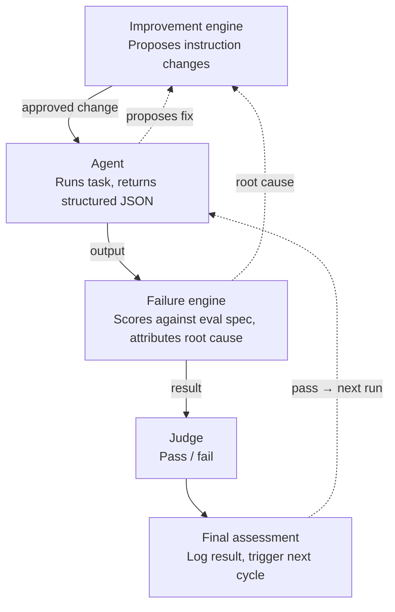

# From Using AI → Having a Team of AI

**Core premise:** Stop prompting Claude for one-off tasks. Build a system where agents, skills, and automation work together — producing higher quality output, more autonomously, with less friction.

---

## The Vision

Most people use AI the way they use a search engine — one question, one answer, one session. The goal here is different: a personal AI infrastructure where specialised agents handle recurring work, skills encode hard-won best practices, and the whole system compounds in capability over time.

**Three principles driving everything:**
- **Autonomy** — agents act without being asked when the trigger is right
- **Quality** — every output is checked, tested, and grounded in context
- **Memory** — decisions, design choices, and project history persist and inform future work

---

## Agents

Discrete, purpose-built agents that either run on a schedule, respond to hooks, or are invoked by name.

### Daily Report Agent
Runs every morning. Pulls together:
- Open tasks and priorities
- Outstanding questions/blockers
- Any overnight updates (GitHub, calendar, messages)
- A recommended focus for the day

Delivers a short, skimmable digest — not a wall of text.

### Coding Agent
Invoked when starting something new. Critically, it doesn't write a single line of code until the project is fully understood and visualised. Three mandatory phases before any implementation:

**Phase 1 — Interrogation.** Asks every question it needs upfront: stack, constraints, audience, success criteria, known edge cases, integrations. Nothing ambiguous survives this phase.

**Phase 2 — Visual brief.** Produces wireframes or mockups of the UI before building it. What it looks like in your head gets externalised and agreed on here — not discovered halfway through implementation. Layouts, flows, key screens. You approve or redirect before any code exists.

**Phase 3 — Exhaustive plan.** A full build plan including: component breakdown, data model, file structure, third-party dependencies, potential complexity spikes, and a ranked improvement backlog generated upfront — not squeezed out over time. The backlog is written into project memory immediately so nothing gets lost to future sessions.

Only then does it build — scaffolding, implementation, test suite, auto-commits, start hook. The plan is the contract; the code fulfils it.

### Research Agent
Given a topic or question, it:
- Searches and synthesises sources
- Proof-checks claims and flags weak assumptions
- Surfaces counterarguments
- Returns a structured brief, not a brain dump

### Ideas & Validation Agent
A thinking partner for new concepts. It:
- Challenges the idea — looks for holes, edge cases, prior art
- Asks "what would have to be true for this to work?"
- Returns a verdict: strong / needs refinement / already exists / worth prototyping

---

## Skills

Reusable, composable modules that any agent or flow can call. Think of these as institutional knowledge encoded into procedures.

### Presentation Hook
Agents don't render UI. They return structured JSON. The rendering layer — built in code — handles charts, tables, digests, and dashboards from that JSON contract.

This is a hard separation: the agent's job is to produce the right data in the right shape, fast. The code's job is to make it look good. Neither does the other's work.

Every agent that produces displayable output declares an **output schema** — a typed JSON contract for its response. The rendering layer consumes that schema and renders the appropriate component: chart, card, digest, table, status panel. Add a new visualisation once in code; every agent that matches the schema gets it for free.

The agent spends zero tokens on formatting, layout, or presentation logic. It returns clean data and stops.

### GitHub Commit Skill
Commits happen automatically — no prompting, no interruption. The skill detects natural checkpoints and acts:
- A feature or function reaches a working state
- Tests pass after a fix
- A refactor completes without breaking anything
- A config or scaffold is laid down before real work begins

At each checkpoint it writes the commit message itself — describing *why* the change was made, not just *what* changed — in conventional commits format, then pushes. The history builds in the background while you stay in flow.

### Diagram Builder
When explaining something complex — an architecture, a flow, a decision — it builds a diagram. Not as an afterthought, but as the primary explanation. Text follows the visual.

### Clarification Protocol
When an agent needs more information to proceed, it doesn't guess or make assumptions. It surfaces exactly the questions it needs answered, waits for input, then continues. No unnecessary interruptions — only when genuinely blocked.

### Pain Points & Hurdles Skill
Every project accumulates blockers, unknowns, and things that are harder than expected. This skill tracks them and actively works to resolve them.

When invoked (or on a schedule), it:
- Pulls the project's current pain points log from project memory
- Reads the relevant context — stack, architecture decisions, what's already been tried
- Runs targeted research on each open hurdle
- Returns a brief per pain point: root cause, recommended fix, relevant prior art or examples

Pain points are written into project memory when they're discovered (by the coding agent, during a session, or manually flagged). Resolved ones are marked with how they were solved — so the same wall doesn't get hit twice.

---

## Memory & Context

### Project Memory
Every project has a living document:
- What it is and why it was built
- Every significant design decision and the reasoning behind it
- What was tried and abandoned, and why
- Current state and open questions
- **Active pain points and hurdles** — with status (open / in progress / resolved) and resolution notes

Agents read this before acting on a project. Updates are written back automatically after meaningful changes.

### Idea Dump → Plan
A raw input mode: paste a block of messages, notes, or voice transcript. The system:
- Extracts the core idea
- Identifies assumptions
- Asks clarifying questions if needed
- Returns a structured plan with next steps

### Project Links
Projects don't exist in isolation — learnings from one should inform the next. Each project can declare links to others, and those links are typed:

- **Learned from** — this project applied a pattern or solved a problem discovered in another
- **Shares context with** — same domain, stack, or user — decisions here are likely relevant there
- **Depends on** — one project's output is another's input (shared libraries, APIs, data)
- **Supersedes** — this is the evolved version of an earlier attempt

When an agent opens a project, it reads not just that project's memory but the linked lessons — pain points resolved elsewhere, design choices that didn't work, approaches that did. Knowledge compounds across the portfolio rather than resetting with each new repo.

### Key Contacts
A lightweight CRM. For each contact: who they are, what you've discussed, what's outstanding. Agents reference this when drafting messages or planning outreach.

---

## Infrastructure

### Multi-Flow Manager
A way of tracking and switching between parallel workstreams — multiple projects, research threads, or ideas in flight at once. Each flow has its own context, memory, and agent state.

### Connected Codespaces
One workspace that knows about others. If a project depends on a shared library, the agent knows about both. Changes propagate. No context lost when jumping between repos.

### Auto-Build Mode
Given a brief, the coding agent builds the full project with minimal interruption:
- Front-loads all questions at the start
- Makes reasonable default decisions autonomously
- Only pauses when it hits a genuine fork it can't resolve alone
- Delivers a working, tested, committed project

### Start Hook
Every coding project has a single command that:
- Starts all required services
- Opens the browser to the right URL
- Loads the project memory
- Surfaces any outstanding tasks or blockers
- Watches for file changes and restarts the relevant service automatically — so changes show in the browser without any manual step

The watcher is selective: a change to a frontend component triggers a hot reload; a change to a server file restarts the server process and refreshes the browser; a change to a config or environment file restarts the full stack. No stale state, no "why isn't my change showing up" — the site always reflects what's on disk.

Zero friction from "I want to work on X" to actually working on X.

### Test Suite (Default On)
Every project ships with tests. Not optional. The coding agent writes them alongside the implementation. Coverage is reported. Tests run on every commit.

### Daily Sign-off Task
A scheduled task that runs at end of day — the system's way of closing out a working session properly.

Sequence:
1. Runs the full test suite against the current working state
2. If all tests pass: writes a daily commit summarising what changed during the session, pushes to remote
3. If any tests fail: does not commit — surfaces a summary of what broke and why before anything gets pushed
4. Updates project memory with the day's progress: what was completed, what's in progress, what's blocked
5. Writes a brief to the Daily Report Agent so tomorrow morning's digest already knows where things stand

The commit message is generated automatically — a concise summary of the session's changes in conventional commits format, not a placeholder. Nothing gets pushed in a broken state. Nothing gets lost to an unsaved session.

### Hybrid Execution Model
The fundamental principle governing how the system is built: **agents do what only agents can do. Code does everything else.**

Agents are slow, expensive, and non-deterministic. They're also the only thing that can reason, synthesise, and make judgement calls. Code is fast, cheap, and reliable. The system should maximise code and minimise agent where the task doesn't require reasoning.

The pattern is **code → agent → code**:

- **Pre-agent code** — fetch data, validate inputs, transform to the shape the agent expects, apply known filters. The agent receives clean, minimal context — not raw noise.
- **Agent** — reasons over that context, makes decisions, produces structured JSON output. It does not fetch, transform, format, or render.
- **Post-agent code** — validates the JSON schema, routes to the right renderer, writes to storage, triggers downstream actions, handles errors. The agent's output is a data contract, not a finished product.

In practice this means:
- Data collection is always code (APIs, DB queries, file reads)
- Parsing and normalisation is always code
- Reasoning, summarisation, prioritisation, and classification is agent
- Rendering, charting, formatting is always code
- Storage writes and downstream triggers are always code

Where a task can be solved deterministically — regex, sorting, filtering, aggregation — it never touches the agent. The agent is reserved for the problems only it can solve. This also makes the system more testable: code layers have unit tests; agent outputs are validated against their JSON schema before anything downstream runs.

---

### Agent Instructions Directory
The registry where every agent lives — not just their current instructions, but their full history, rationale, and relationship to every other agent and skill in the system.

Each agent entry contains:
- **Name** — following a consistent naming convention (verb-noun or domain-role, e.g. `research-synthesiser`, `code-reviewer`, `daily-reporter`)
- **Description** — one sentence on what the agent does, one on what it explicitly doesn't do (the boundary matters as much as the scope)
- **Instructions** — the current system prompt, composed from shared skill modules plus agent-specific logic
- **Changelog** — every meaningful change to this agent, when it was made, why, and what behaviour it altered

The directory is versioned. Rolling back an agent to a previous behaviour is a one-line change.

---

### Agent Directory Skill
A skill that keeps the directory clean, organised, and non-redundant. It runs in two modes:

**Maintenance mode** — periodically audits the full directory and produces a report covering:
- **Overlap candidates** — pairs or groups of agents with substantially similar instruction surface. Flags them with a recommended action: merge into one agent, extract the shared logic into a skill, or keep separate with a clearer boundary
- **Skill extraction candidates** — instruction blocks that appear in multiple agents and belong in a reusable skill instead
- **Grouping** — agents clustered by domain or function (e.g. dev tools, research, reporting, meta/system), with recommendations for folder structure or tagging
- **Naming audit** — agents whose names are ambiguous, inconsistent with the convention, or too similar to another agent's name

**Creation mode** — invoked whenever a new agent is being built. This is the gate before any instructions are written:

1. Reads every existing agent's name, description, and instruction summary
2. Reads every existing skill
3. Identifies the closest existing agents — what they already cover, where they fall short
4. Makes a recommendation: **new agent**, **extend an existing one**, **new skill only**, or **combine two existing agents**
5. If proceeding with a new agent: determines which existing skills can be composed in rather than rewritten, identifies what genuinely needs to be written from scratch
6. Writes the agent entry — name (checked against naming convention), description (scoped tightly), instructions (referencing shared skills, not duplicating them)
7. Initialises the changelog with entry `v0.1 — created. Rationale: [why this agent exists and why existing agents don't cover it]`

Nothing gets added to the directory without passing through this skill. The result is a registry that stays legible as it grows rather than becoming a graveyard of overlapping, ambiguously named prompts.

### Ultimate Agent Builder
A meta-agent that handles the design and creation of new agents. It orchestrates the Agent Directory Skill's creation mode, then goes further:

- Invokes the Agent Directory Skill to audit what already exists and get a recommendation before anything is written
- If the recommendation is to proceed: takes the pre-checked name, description, and instruction scaffold from the skill and builds out the full implementation
- Assesses whether a database or persistent store is needed — and suggests the right shape (key-value, relational, vector, or flat file) based on what the agent will actually do
- Writes the eval spec alongside the instructions — target, failure modes, scoring rubric — so the agent is testable from its first run
- If extending an existing agent: diffs the proposed change against current instructions, updates the changelog, re-runs the overlap check to see if the change creates new duplication

It asks clarifying questions before building, not during. Delivers a working agent spec, not a rough draft.

### Agent Self-Improvement Loop
Agents don't stay static. Each agent can observe its own performance and propose improvements:

- After a set number of runs (or on a schedule), the agent reviews a sample of its own outputs against a simple rubric — did it answer the right question? was the output the right shape? did it get stuck unnecessarily?
- It drafts a proposed instruction change and writes it to the Agent Instructions Directory as a **pending change** — not applied automatically
- The Ultimate Agent Builder reviews the proposal: checks for regressions, conflicts with other agents, and whether the change belongs in a shared skill instead
- Approved changes are applied and logged; rejected ones are kept with a reason so the loop learns what kinds of proposals don't land

### Agent Evaluation Framework
The root cause of "have to reask for improvements" and "no way of knowing if an agent is working" — both solved the same way: define what good looks like before the agent runs for the first time, then measure against it automatically.

Every agent has an **eval spec** written at creation time (by the Ultimate Agent Builder) containing:

- **Target** — what a successful run looks like in concrete, measurable terms. Not "gives a good answer" but "identifies all blockers", "produces a valid JSON schema", "completes without clarification for well-formed inputs"
- **Failure modes** — the named ways an agent can underperform, each with a detection heuristic. E.g. "hallucinated a file path", "asked a question it should have answered from context", "output format didn't match spec"
- **Scoring rubric** — a lightweight pass/fail or scored checklist run after each output. Automated where possible; flagged for human review where not
- **Failure attribution** — when a run scores below threshold, the framework produces a root cause: was it the instruction? the context it was given? the model? an edge case the spec didn't cover? This becomes the input to the self-improvement loop

The feedback loop then closes naturally:

1. Agent runs → output scored against eval spec
2. Below threshold → failure attributed to a root cause
3. Root cause logged as a pending improvement in the Agent Instructions Directory
4. Ultimate Agent Builder reviews and applies or rejects the change
5. Agent reruns the failed case — did the fix work?

Without the eval spec, improvement is guesswork. With it, the system knows when it's getting better and why.

---

## Open Questions

- What's the right orchestration layer — Claude Code, a custom Node runner, something else?
- How does project memory get stored and versioned? (Git-tracked markdown vs. structured DB)
- Which agents run on a schedule vs. on-demand vs. triggered by events?
- How do agents hand off to each other cleanly without losing context?
- What's the MVP — the smallest slice that proves the concept works?
- How are project links surfaced to agents — injected into context at session start, or fetched on demand?
- What's the approval flow for self-improvement proposals — a dedicated review UI, or inline in the daily report?
- How do you prevent instruction drift across agents over many improvement cycles — is there a canonical "floor" that can't be changed without manual override?
- What tool generates the wireframes in Phase 2 of the Coding Agent — inline SVG, a dedicated design tool, or something Claude renders directly?
- How granular should eval specs be — per agent, per task type, or per individual run case?
- Who writes the first eval spec for a new agent — the Ultimate Agent Builder, or does it require human input to define what "good" looks like?
- Where does the JSON output schema registry live — alongside the Agent Instructions Directory, or co-located with the rendering layer code?
- How do you handle agent output that partially conforms to schema — strict reject, or partial render with flagged fields?

---

## Possible First Build

A single loop that proves the architecture:

1. Dump a rough idea into the system
2. Clarification agent asks its questions
3. Coding agent scaffolds and builds
4. Test suite runs
5. Commit skill writes and pushes
6. Project memory is initialised
7. Daily report agent knows about the new project tomorrow morning

That's the flywheel. Once it runs end-to-end, everything else is an extension.
